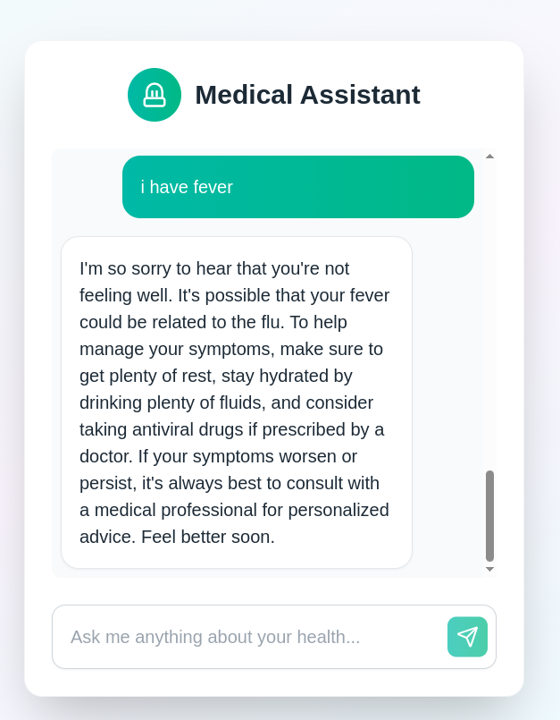
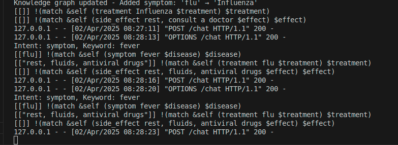

# Medical Chatbot




A Flask-based medical chatbot with a Next.js frontend, leveraging MeTTa for knowledge representation and Grok (via xAI) for intent classification, keyword extraction, and humanized responses. This chatbot answers health-related questions about symptoms, diseases, treatments, side effects, and FAQs, dynamically updating its knowledge base as users interact with it.

## Features

- **Symptom Queries**: Identifies possible diseases from symptoms (e.g., "I’m sneezing a lot" → common cold).  
- **Treatment Suggestions**: Provides treatment options for diseases (e.g., "How do I treat flu?" → rest, fluids, antiviral drugs).  
- **Side Effects**: Lists potential side effects of treatments (e.g., "What are side effects of antihistamines?" → drowsiness, dry mouth).  
- **FAQs**: Answers common questions, adding new ones as needed (e.g., "What causes sneezing?" → dynamically generated response).  
- **Dynamic Knowledge**: Automatically adds new symptoms, treatments, side effects, and FAQs to the MeTTa knowledge graph using Grok-generated responses.  
- **Web Interface**: A beautiful, responsive frontend built with Next.js and Tailwind CSS for user interaction.

## Project Structure

```
chatbotmetta/
├── app.py              # Flask app with /chat endpoint
├── knowledge.py        # MeTTa knowledge graph initialization
├── medicalrag.py       # MedicalRAG class for knowledge management
├── chatbot.py          # Chatbot logic and Grok integration
├── requirements.txt    # Python dependencies
├── .env                # Environment variables (e.g., GROQ_API_KEY)
└── README.md           # Project documentation

chatbot-frontend/       # Separate Next.js project
├── app/
│   └── page.tsx        # Frontend page for chatbot interaction
├── tailwind.config.js  # Tailwind CSS configuration
├── package.json        # Frontend dependencies
└── ...
```

## Prerequisites

- **Python 3.8+**: For the Flask backend.  
- **Node.js 18+**: For the Next.js frontend.  
- **Grok API Key**: Obtain from xAI and set as `GROQ_API_KEY` in `.env`.  
- **Postman or cURL**: Optional, for testing the API directly.

## Setup

### Backend Setup

1. **Clone the Repository**:

2. **Create a Virtual Environment**:
    ```bash
    python -m venv venv
    source venv/bin/activate  # On Windows: venv\Scripts\activate
    ```

3. **Install Dependencies**:
    ```bash
    pip install -r requirements.txt
    python -m spacy download en_core_web_md
    ```

4. **Set Environment Variable**:
    Create a `.env` file in the `chatbotmetta/` directory:
    ```
    GROQ_API_KEY=your-grok-api-key-here
    ```

5. **Run the Backend**:
    ```bash
    python app.py
    ```
    The Flask app will start on `http://localhost:5000`.

### Frontend Setup

1. **Create the Next.js Project (if not already set up)**:
    ```bash
    npx create-next-app@latest chatbot-frontend
    cd chatbot-frontend
    ```

2. **Install Tailwind CSS**:
    ```bash
    npm install -D tailwindcss postcss autoprefixer
    npx tailwindcss init -p
    ```

3. **Update `tailwind.config.js`**:
    ```js
    /** @type {import('tailwindcss').Config} */
    module.exports = {
      content: ["./app/**/*.{js,ts,jsx,tsx}"],
      theme: { extend: {} },
      plugins: [],
    }
    ```

4. **Update `app/globals.css`**:
    ```css
    @tailwind base;
    @tailwind components;
    @tailwind utilities;
    ```

5. **Add `page.tsx`**:
    Replace `app/page.tsx` with the code provided earlier.

6. **Run the Frontend**:
    ```bash
    npm run dev
    ```
    The frontend will start on `http://localhost:3000`.

## Usage

### Via Web Interface

1. Ensure the backend is running (`python app.py`).
2. Open `http://localhost:3000` in your browser.
3. Enter a query (e.g., "I’m sneezing a lot") and click "Send".
4. View the response and check the backend terminal for knowledge updates (e.g., "Knowledge graph updated - Added symptom: 'sneezing' → 'common cold'").

### Via API Endpoint

- **Endpoint**: `http://localhost:5000/chat`  
- **Method**: POST  
- **Body**: JSON with `{"query": "<your-question>"}`  
- **Headers**: `Content-Type: application/json`

Example:
```bash
curl -X POST -H "Content-Type: application/json" -d '{"query": "I have a fever"}' http://localhost:5000/chat
```

Response:
```json
{
     "selected_question": "I have a fever",
     "humanized_answer": "Oh no, a fever? That could be the flu—try resting and staying hydrated. Antiviral drugs might help if a doctor agrees. Take care!"
}
```

### Testing with Postman

- **URL**: `http://localhost:5000/chat`  
- **Method**: POST  
- **Headers**: `Content-Type: application/json`  
- **Body (raw JSON)**:
  ```json
  {
        "query": "What’s the treatment for allergies?"
  }
  ```

Send and verify the response. Check the terminal for knowledge updates if applicable.

## How It Works

- **Knowledge Base**: Initialized in `knowledge.py` with MeTTa, storing symptoms, diseases, treatments, side effects, and FAQs.  
- **Knowledge Management**: `medicalrag.py` handles querying and updating the MeTTa atom space.  
- **Chatbot Logic**: `chatbot.py` uses Grok to classify intent (symptom, treatment, side effect, faq, unknown), extract keywords, and generate responses or new knowledge.  
- **Backend**: `app.py` exposes a `/chat` endpoint, integrating all components.  
- **Frontend**: `page.tsx` provides a user-friendly interface with Tailwind CSS styling, fetching responses from the backend.  
- **Dynamic Updates**: When new information is encountered (e.g., unknown symptom), Grok generates a response, which is added to the knowledge graph and logged.

## Example Queries

- "I’m sneezing a lot" → Adds "sneezing" to the knowledge graph if not present.  
- "How do I treat allergies?" → Suggests and stores a treatment if unknown.  
- "What are side effects of antihistamines?" → Lists or adds side effects.  
- "What causes sneezing?" → Answers or adds as a new FAQ.

## Troubleshooting 
- **500 Errors**: Check backend logs for Grok API issues or MeTTa errors. Ensure `GROQ_API_KEY` is set.  
- **Frontend Errors**: Verify the backend URL in `page.tsx` matches your Flask port (default: 5000).  
- **No Response**: Confirm both backend (`localhost:5000`) and frontend (`localhost:3000`) are running.

## Future Improvements

- Implement real-time updates (e.g., WebSocket) for knowledge graph changes.  
- Expand the knowledge base with more medical data from sources like MedlinePlus.  
- Add user authentication for personalized interactions.  
- Enhance error handling with detailed API responses.  
- Support voice input/output for accessibility.  