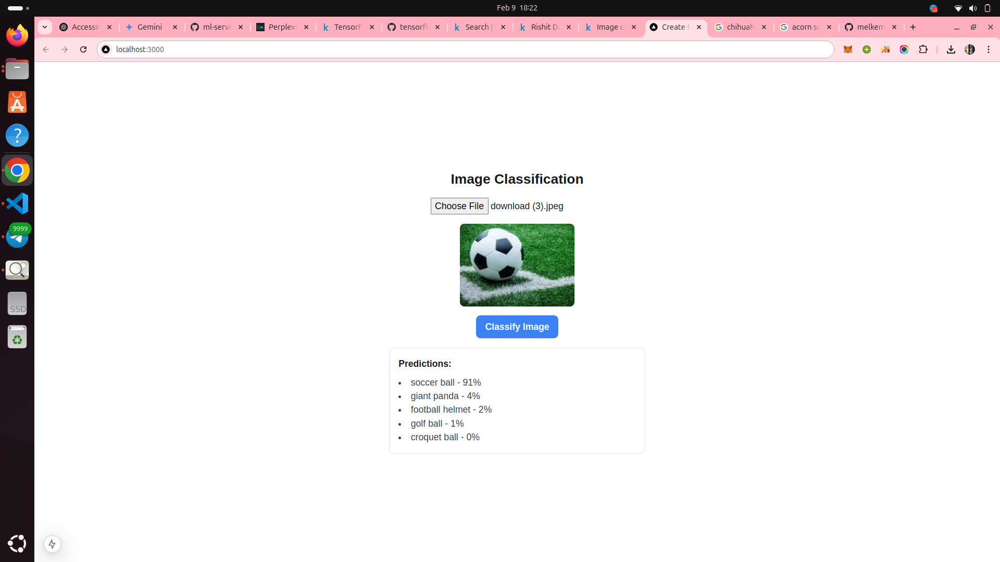

# Image Classification with MobileNet V1

This project implements a REST API for image classification using a MobileNet V1 model with TensorFlow Lite and FastAPI.
You can see the list of objects in `backend/labels.txt`. The model can predict from a list of 1001 different objects, including various animals and other items.

## Features

- Image classification using MobileNet V1 model
- FastAPI for efficient API handling
- Docker containerization for easy deployment
- Returns top 5 predictions for each image

## Prerequisites

- Docker
- Docker Compose

## Setup and Installation

1. Clone the repository:
    ```sh
    git clone  https://github.com/melkemk/icogtasks.git
    cd image_ml
    ```

2. Build and run the Docker containers:
    ```sh
    docker-compose up --build
    ```

## Usage

Once the server is running, you can use the API to classify images:

## API Usage

1. The API will be available at `http://localhost:8000`

2. Use the `/predict/` endpoint to classify an image:
    - Method: POST
    - Content-Type: multipart/form-data
    - Body: Include the image file with key 'file'

3. Example using curl:
    ```sh
    curl -X POST "http://localhost:8000/predict/" -H "accept: application/json" -H "Content-Type: multipart/form-data" -F "file=@path_to_your_image.jpg"
    ```

4. The API will return a JSON response with the top 5 predictions:
    ```json
    {
      "predictions": [
        {"class": "golden retriever", "confidence": 0.85},
        {"class": "Labrador retriever", "confidence": 0.10},
        {"class": "dog", "confidence": 0.03},
        {"class": "puppy", "confidence": 0.01},
        {"class": "canine", "confidence": 0.005}
      ]
    }
    ```

## Frontend Usage

The frontend is available at `http://localhost:3000`. It provides a user-friendly interface to upload images and view classification results.

1. Open your web browser and navigate to `http://localhost:3000`.

2. Use the upload button to select an image file from your computer.

3. Click the "Classify" button to send the image to the backend API.

4. View the top 5 predictions displayed on the results page.
 
## Project Structure

- `backend/`: Contains the FastAPI application 
- `main.py`: Main application file
- `backend/1.tflite`: MobileNet V1 TensorFlow Lite model
- `backend/labels.txt`: Labels for the model's classes
- `frontend/`: Contains the Next.js frontend 
- `docker-compose.yml`: Docker Compose configuration    
- `backend/Dockerfile`: Docker configuration for the backend 
- `frontend/Dockerfile`: Docker configuration for the frontend 

## Technologies Used

- FastAPI
- TensorFlow Lite
- Docker
- Python 3.9
- NumPy
